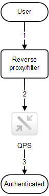

# Authentication

Authentication in Qlik Sense Enterprise is managed by the Qlik Sense Proxy Service (QPS). The QPS authenticates all users regardless of Qlik Sense client type. This means that the QPS also authenticates users of the Qlik Management Console (QMC).

Qlik Sense Enterprise always asks an external system to verify who the user is and if the user can prove it. The interaction between Qlik Sense and the external identity provider is handled by authentication modules.

For a module to communicate with Qlik Sense, it has to be trusted. Transport Layer Security (TLS) and certificate authentication are used to authorize external components for communication with Qlik Sense.

## Browser

When connecting to Qlik Sense Enterprise from a browser, you can listen to the  `OnAuthenticationInfo`-notification. You should listen to this and react accordingly
in your web application.

See [Qlik Sense help: OnAuthenticationInformation](https://help.qlik.com/en-US/sense-developer/Subsystems/ProxyServiceAPI/Content/ProxyServiceAPI/ProxyServiceAPI-Msgs-Proxy-Clients-OnAuthenticationInformation.htm) for more information on `OnAuthenticationInfo`.

A simple example:

```javascript
const cfg = {
    schema: {},
    session: {
      urlParams: {
        reloadUri: location.href
      }
    },
    listeners: {
        "notification:OnAuthenticationInformation": ( authInfo ) => {
            if ( authInfo.mustAuthenticate ) {
                location.href = authInfo.loginUri;
            }
        }
};

enigma.getService( "qix", cfg );
```


## Header authentication

Header authentication is often used in conjunction with a Single Sign-On (SSO) system that supplies a reverse proxy or filter for authenticating the user.

The figure below shows a typical flow for authenticating a user using header authentication.



1. The user accesses the system and authenticates to the reverse proxy.
2. The reverse proxy injects the username into a defined HTTP header.
The header must be included in every request to the Qlik Sense Proxy Service (QPS).
3. The user is authenticated.

**Note:** For this solution to be secure, the end-user must not be able to communicate directly with the QPS but instead be forced to go through the reverse proxy/filter.

**See also:** [Header solution](http://help.qlik.com/en-US/sense/Subsystems/PlanningQlikSenseDeployments/Content/Server/Server-Security-Authentication-Solutions-Header-Solution.htm)


### X-Qlik-User header

The X-Qlik-User header contains the unique user ID of the authenticated user. It is sent to the Qlik Sense Repository Service (QRS), Qlik Management Console (QMC), Qlik Sense Engine Service (QES), and to external modules.

The header has the following format:

`"X-Qlik-User": "UserDirectory=<directory>; UserId=<userid>"`
